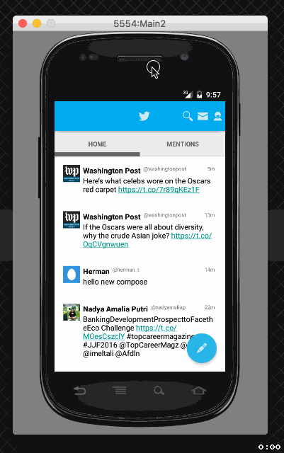

# Project 4 - *Simple Tweets*

**Simple Tweets** is an android app that allows a user to view home and mentions timelines, view user profiles with user timelines, as well as compose and post a new tweet. The app utilizes [Twitter REST API](https://dev.twitter.com/rest/public).

Time spent: **21** hours spent in total

## User Stories

The following **required** functionality is completed:

* [x] The app includes **all required user stories** from Week 3 Twitter Client
* [x] User can **switch between Timeline and Mention views using tabs**
  * [x] User can view their home timeline tweets.
  * [x] User can view the recent mentions of their username.
* [x] User can navigate to **view their own profile**
  * [x] User can see picture, tagline, # of followers, # of following, and tweets on their profile.
* [x] User can **click on the profile image** in any tweet to see **another user's** profile.
 * [x] User can see picture, tagline, # of followers, # of following, and tweets of clicked user.
 * [x] Profile view includes that user's timeline
* [x] User can [infinitely paginate](http://guides.codepath.com/android/Endless-Scrolling-with-AdapterViews-and-RecyclerView) any of these timelines (home, mentions, user) by scrolling to the bottom

The following **optional** features are implemented:

* [x] User can view following / followers list through the profile
* [x] Implements robust error handling, [check if internet is available](http://guides.codepath.com/android/Sending-and-Managing-Network-Requests#checking-for-network-connectivity), handle error cases, network failures (Toasts)
* [x] When a network request is sent, user sees an [indeterminate progress indicator](http://guides.codepath.com/android/Handling-ProgressBars#progress-within-actionbar)
* [x] User can **"reply" to any tweet on their home timeline**
  * [x] The user that wrote the original tweet is automatically "@" replied in compose
* [x] User can click on a tweet to be **taken to a "detail view"** of that tweet
 * [x] User can take favorite (and unfavorite) or retweet actions on a tweet
* [x] Improve the user interface and theme the app to feel twitter branded
* [x] User can **search for tweets matching a particular query** and see results

The following **bonus** features are implemented:

* [x] Use Parcelable instead of Serializable using the popular [Parceler library](http://guides.codepath.com/android/Using-Parceler). (Use the Android Studio plugin instead)
* [x] Apply the popular [Butterknife annotation library](http://guides.codepath.com/android/Reducing-View-Boilerplate-with-Butterknife) to reduce view boilerplate.
* [x] Leverage the popular [GSON library](http://guides.codepath.com/android/Using-Android-Async-Http-Client#decoding-with-gson-library) to streamline the parsing of JSON data.
* [x] User can view their direct messages (or send new ones)

The following **additional** features are implemented:

* [x] List anything else that you can get done to improve the app functionality!

  * User can see their liked tweets in Profile

## Video Walkthrough 

Here's a walkthrough of implemented user stories:

GIF created with [LiceCap](http://www.cockos.com/licecap/).

## Notes

Describe any challenges encountered while building the app.

## Open-source libraries used

- [Active Android](https://github.com/pardom/ActiveAndroid/wiki/Getting-started) ActiveAndroid is an active record style ORM (object relational mapper).
- [Android Async HTTP](https://github.com/loopj/android-async-http) - Simple asynchronous HTTP requests with JSON parsing
- [Butter Knife](http://jakewharton.github.io/butterknife/) - Field and method binding for Android views
- [Glide](https://github.com/bumptech/glide) - An image loading and caching library for Android focused on smooth scrolling
- [Gson](https://github.com/google/gson) - A Java serialization library that can convert Java Objects into JSON and back.
- [Android PagerSlidingTabStrip](https://github.com/astuetz/PagerSlidingTabStrip) - Interactive paging indicator widget, compatible with the ViewPager from the Android Support Library.  

## License

    Copyright [2016] [Heung Ming Tai]

    Licensed under the Apache License, Version 2.0 (the "License");
    you may not use this file except in compliance with the License.
    You may obtain a copy of the License at

        http://www.apache.org/licenses/LICENSE-2.0

    Unless required by applicable law or agreed to in writing, software
    distributed under the License is distributed on an "AS IS" BASIS,
    WITHOUT WARRANTIES OR CONDITIONS OF ANY KIND, either express or implied.
    See the License for the specific language governing permissions and
    limitations under the License.

